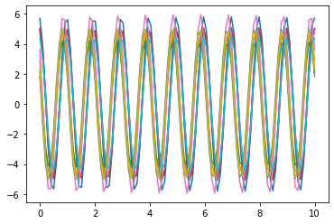
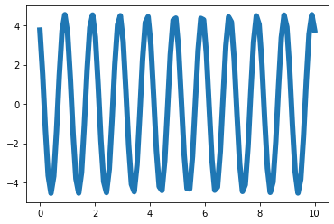
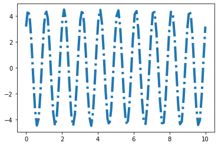
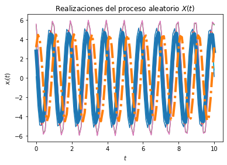
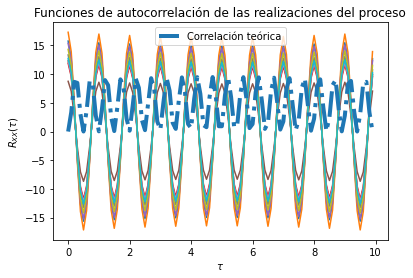

## Universidad de Costa Rica
### Escuela de Ingeniería Eléctrica
#### IE0405 - Modelos Probabilísticos de Señales y Sistemas

---

* Estudiante: **Daniela Oporta Abarca**
* Carné: **B55160**

* Estudiante: **Steven Murillo Rodriguez**
* Carné: **B75353**
### Laboratorio 4

Librerías


```python

import numpy as np
from scipy import stats
import matplotlib.pyplot as plt

```

import numpy as np
from scipy import stats
import matplotlib.pyplot as plt

Variables Aleatorias 


```python
zr=0
vaA = stats.norm(5, np.sqrt(1/5))
vaZ = stats.uniform(zr, np.pi/2)
```

Los parámetros T, t_final y N son elegidos arbitrariamente
Creación del vector de tiempo


```python
T = 100			# número de elementos
t_final = 10	# tiempo en segundos
t = np.linspace(zr, t_final, T)
```


```python
# Inicialización del proceso aleatorio X(t) con N realizaciones
N = 10
X_t = np.empty((N, len(t)))

```


```python
# Creación de las muestras del proceso x(t) (A y Z independientes)
for i in range(N):
	A = vaA.rvs()
	Z = vaZ.rvs()
	x_t = A * np.cos(2*np.pi*T*t + Z)
	X_t[i,:] = x_t
	plt.plot(t, x_t)

```


    

    


```python
# Promedio de las N realizaciones en cada instante (cada punto en t)
P = [np.mean(X_t[:,i]) for i in range(len(t))]
plt.plot(t, P, lw=6)
```


    [<matplotlib.lines.Line2D at 0x29d24ad7f40>]


    

    


```python

# Graficar el resultado teórico del valor esperado
E = ( np.cos(2*np.pi*T*t) + np.sin(2*np.pi*T*t))*10/np.pi
plt.plot(t, E, '-.', lw=4)

```


    [<matplotlib.lines.Line2D at 0x29d24b3caf0>]


    

    


```python
import numpy as np
from scipy import stats
import matplotlib.pyplot as plt

# Variables aleatorias A y Z
zr=0
vaA = stats.norm(5, np.sqrt(1/5))
vaZ = stats.uniform(zr, np.pi/2)

# Los parámetros T, t_final y N son elegidos arbitrariamente

# Creación del vector de tiempo
T = 100			# número de elementos
t_final = 10	# tiempo en segundos
t = np.linspace(zr, t_final, T)

# Inicialización del proceso aleatorio X(t) con N realizaciones
N = 10
X_t = np.empty((N, len(t)))	# N funciones del tiempo x(t) con T puntos

# Creación de las muestras del proceso x(t) (A y Z independientes)
for i in range(N):
	A = vaA.rvs()
	Z = vaZ.rvs()
	x_t = A * np.cos(2*np.pi*T*t + Z)
	X_t[i,:] = x_t
	plt.plot(t, x_t)

# Promedio de las N realizaciones en cada instante (cada punto en t)
P = [np.mean(X_t[:,i]) for i in range(len(t))]
plt.plot(t, P, lw=6)

# Graficar el resultado teórico del valor esperado
E = ( np.cos(2*np.pi*T*t) + np.sin(2*np.pi*T*t))*10/np.pi
plt.plot(t, E, '-.', lw=4)

# Mostrar las realizaciones, y su promedio calculado y teórico
plt.title('Realizaciones del proceso aleatorio $X(t)$')
plt.xlabel('$t$')
plt.ylabel('$x_i(t)$')
plt.show()
```


    

    


Gráfica 2


```python
p2=np.empty((N,len(t)))
for i in range(N):
    B=vaA.rvs()
    X2=B*np.cos(2*np.pi*T*t + np.pi/2)
    p2[i,:] =X2


P2 = [np.mean(p2[:,i]) for i in range(len(t))]

# T valores de desplazamiento tau
desplazamiento = np.arange(T)
taus = desplazamiento/t_final

# Inicialización de matriz de valores de correlación para las N funciones
asd = np.empty((N, len(desplazamiento)))

# Nueva figura para la autocorrelación
plt.figure()
```


    <Figure size 432x288 with 0 Axes>


    <Figure size 432x288 with 0 Axes>


```python
# Cálculo de correlación para cada valor de tau
for n in range(N):
	for i, tau in enumerate(desplazamiento):
		asd[n, i] = np.correlate( p2[n,:], np.roll(p2[n,:], tau))/T
	plt.plot(taus, asd[n,:])

# Valor teórico de correlación
Rxx = 9.5*np.cos(2*np.pi*T*t + np.pi/2)*np.cos((2*np.pi*T)*(t+taus)+np.pi/2)

# Gráficas de correlación para cada realización y la
plt.plot(taus, Rxx, '-.', lw=4, label='Correlación teórica')
plt.title('Funciones de autocorrelación de las realizaciones del proceso')
plt.xlabel(r'$\tau$')
plt.ylabel(r'$R_{XX}(\tau)$')
plt.legend()
plt.show()
```


    

    


```python

```
